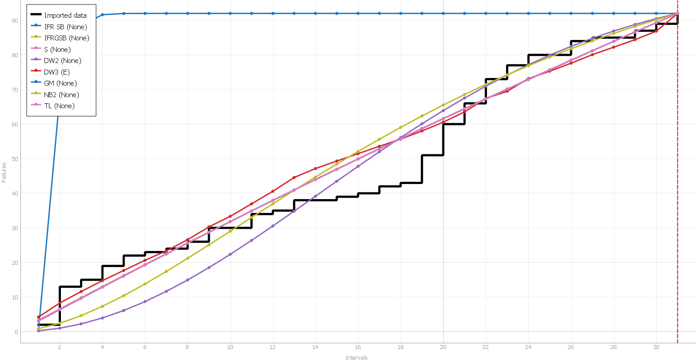
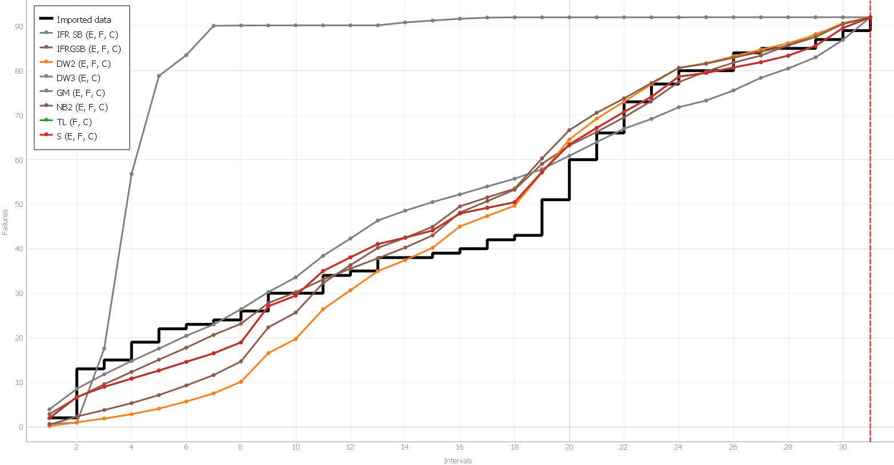
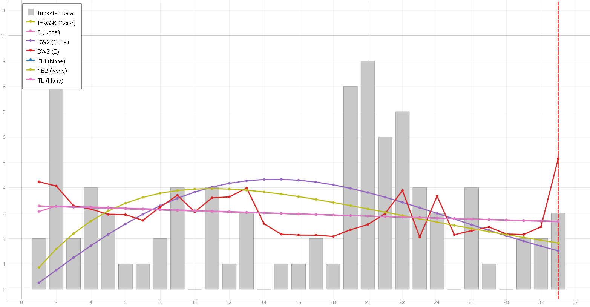
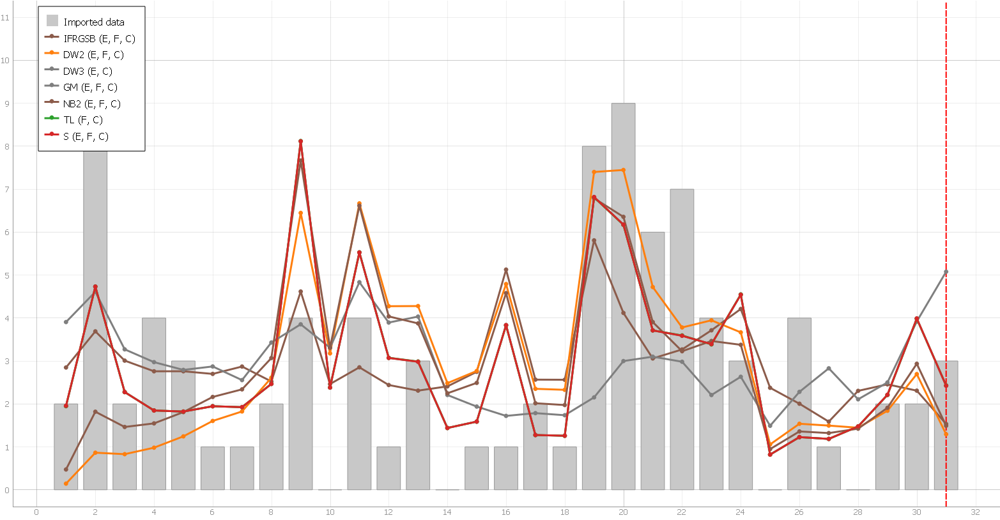
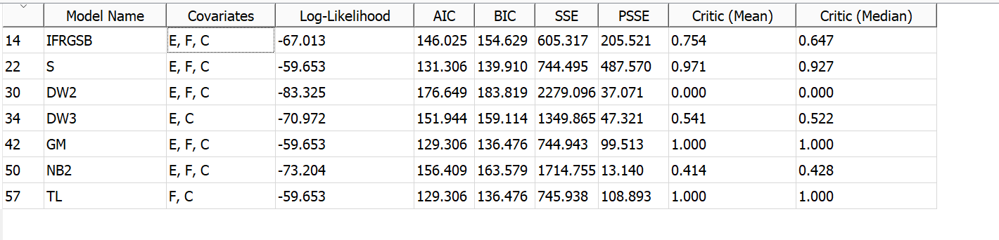
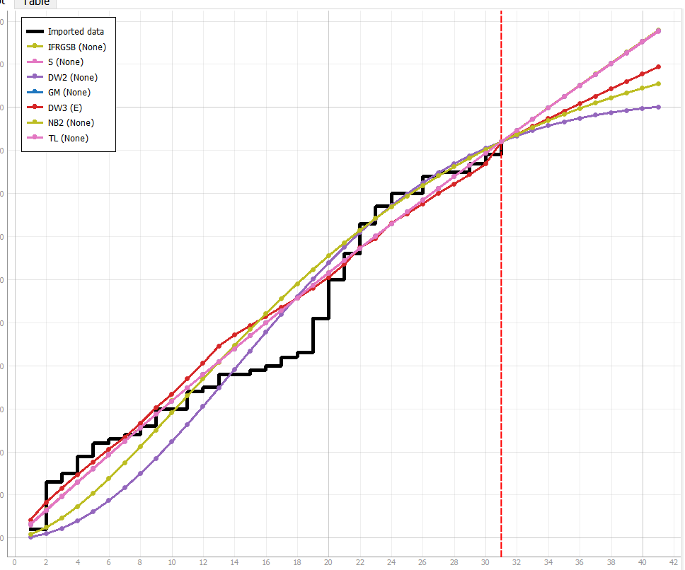
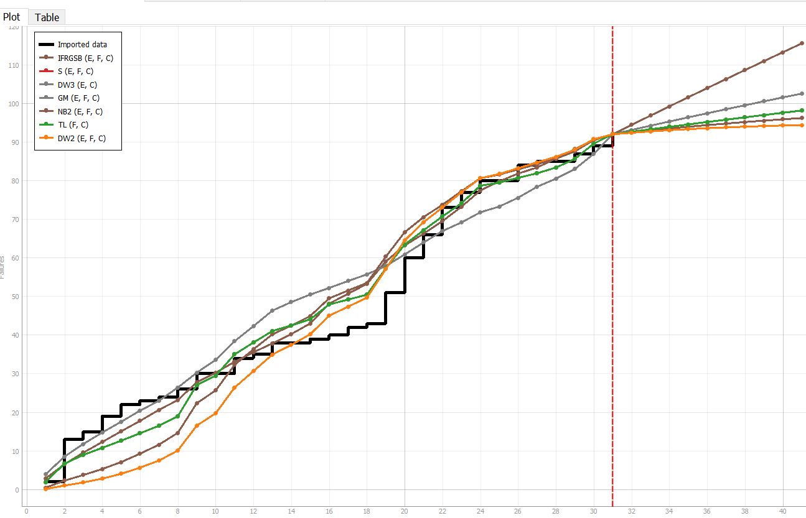
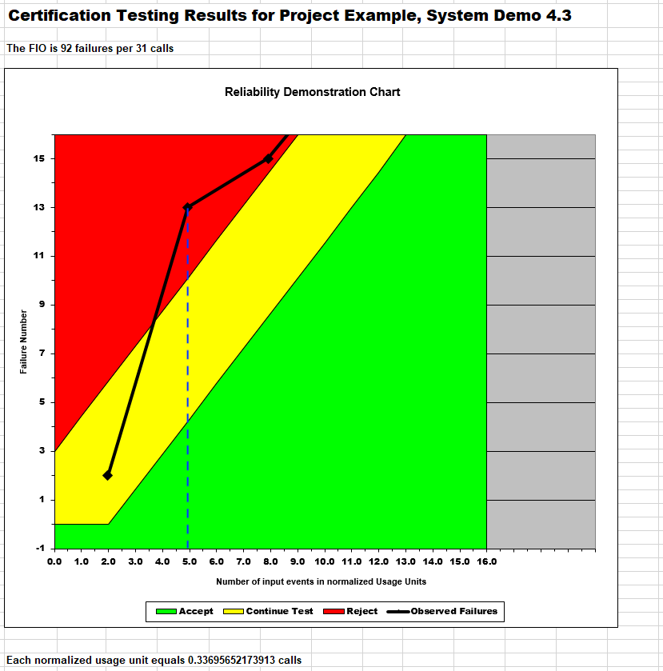

**SENG 637- Dependability and Reliability of Software Systems\***

**Lab. Report \#5 – Software Reliability Assessment**

| Group: 2         |
| ---------------- |
| Corey Yang-Smith |
| Eric (Sieu) Diep |
| Hao Liu          |
| Mehreen Akmal    |
| Jenn Bushey      |

# 1 Introduction

This lab is to analyze software failure data using C-SFRAT and RDC (Reliability Demonstration Chart). Both are reliability growth assessment tool that provides a graphical representation of the reliability of the assessed software based on its failure data.

In this lab, a set of failure data is given in term of time interval (T), failure count (FC), execution time (E) in hours, failure identification work (F) in person hours, and compute time failure (C) in hours. This set of data will be plotted using the two tools mentioned, and a thorough analysis will be done accordingly to gain an insight of the data while learning about the features offered by tools.

# 2 Assessment Using Reliability Growth Testing

C-SFRAT is chosen to perform the reliability growth testing. Following are the reliability graphs of the failure data using all models available in C-SFRAT. For simplicity and demonstration purposes, the models are ran with no covariates selected (no-covariate) and all covariates selected, as applicable, (all-covariates) to produce two sets of graphs. Note that the DW3 model requires at least one covariate to work. This is the an exception to the no-covariate rule mentioned, but the resulted graph is still similar to the other no-covariate graphs. Also, noted that the maiximum covariates taken by each model are different as well.

_Figure 1. Reliability graph of C-SFRAT models with no covariates_

_Figure 2. Reliability graph of C-SFRAT models with all covariates_

According to the graphs, all models fit the failure data quite well except the IFR SB model, which does not fit at all to the data. Thus, the IFR SB model is removed in the following intensity graphs.

_Figure 3. Failure intensity graph of C-SFRAT models with no covariates_

_Figure 4. Failure intensity graph of C-SFRAT models with all covariates_

The fitted lines in figure 1 and figure 2 are quite similar. Both figures seem to fit the failure data well with no significant difference. This is difficult to distinguish the impact of the covariates on the model performance.

However, in the intensity graphs, the difference between the no-covariates and all-covariates are significance. The no-covariates models are underfit, while the all-covariate are overfit. Overall, the all-covariate models seem to perform better than no-covariate models. A better fitted line can be achieved with further fine-tuning the models by selecting the right number of covariates. Noted that this is beyond the scope of this lab,which is to select a set of models that would provide the best fit for the project data.

C-SFRAT provide the model comparison summarized in the table below:

_Table 1 Model Comparison_

C-SFRAT does not have an option to display the MTTF and the failure rate, however, it does calculate the cumulative failure count. The MTTF and failure rate can be calculated using this information.

MTTF = total time / total failure = 31 / 92 = 0.337

Failure rate = total failure / total time = 92 /31 = 2.97

It is difficult to comment on these numbers whether they are acceptable or not without a clear specification or standard provided by the software owner. The acceptable range depends on many factors, including but not limited to the criticality of the application, the industry standard, user expectation, budget allocated to the application development, etc.

However, it was noted that the cumulative failure count is consistently increasing without a sign of plateauing within the available data range. If this increasing trend doesn't flat out into the future, then the reliability of the software is unacceptable.

It was also noted in the intensity graph, that the failure intensity spikes up in the beginning, then dies down, and spiked up significantly at time 19 to 25. Then dies down, and has a spiking up trend at the end of the data interval. If it is indeed spike up significantly into the future, it can be concluded that there are abnormality in the system that will need attention.

C-SFRAT indeed predicts an increasing trend into the future as shown in the two figures below. Again, this is not an acceptble behaviour as we expect the cumulative count of failure to flat out eventually. It is also noted that this is simply a prediction, the reality may be different when more future data is available. But it worths to investigate the system.

_Figure 5 - Failure count prediction into the future with no-covariate_

_Figure 6 - Failure count prediction into the future with all-covariate_

Noted that different models have quite a difference in the increasing rate.

# 3 Assessment Using Reliability Demonstration Chart

We used the default risk parameters for: alpha (the developer's risk), beta (the users' risk), and gamma (the discrimination ratio).

-   Discrimination Ratio γ 2.000
-   Developer's Risk α 0.100
-   User's Risk β 0.100

Given these values and using Musa's formulae we can use the RDC-11 to calculate the slope of the accept and reject regions of the chart.

The normalized usage unit is calculated by dividing the input event when observed (time interval) by the MTTF. For the second point in the chart, we have a cumulative failure count of 13 at time interval 2 and MTTF of 0.337. The normalized usage unit is therefore 2/0.337 = 5.94 as indicated in the RDC-11 worksheet.

It appears that the RDC-11 plot isn't functioning as it should. The point (5.94, 13) is being plot at (4.94, 13). Please see Figure 7 for an illustration of this bug.

_Figure 7. RDC-11_

The RDC was then plot in excel to produce Figure 8 to better display all failure numbers using the same accept and reject slope and intercept as provided in RDC-11.

_Figure 8. RDC_

Inputting our original values, we create Figure 8 as the RDC. This represents a MTTF of 0.337 or FIO of 92/31 = 2.968. Here we observe that the second time interval puts the line representing the number of failures versus normalized input events initially goes into the reject area but then progresses into the accept area, it could indicate that initially, the software was not meeting its reliability requirements, but as testing or usage continued, improvements or optimizations were made to the software, leading to a decrease in failures and an eventual meeting of the reliability requirements.

This point indicates that the software's reliability is at the minimum acceptable level. The position of the line relative to the boundary between the rejected and continue regions is crucial for assessing the software's reliability. If the line goes above this boundary, it indicates that the software does not meet the minimum reliability requirements and is rejected. If it falls below this boundary, it indicates that the software meets or exceeds the minimum reliability requirements and can continue to be used.

When the line is just touching the boundary, it suggests that there is little to no margin for further improvement in reliability without exceeding the minimum acceptable level. Any further improvements would be aimed at increasing reliability beyond the minimum requirements, which may or may not be necessary depending on the specific requirements and goals of the software project.

Thus, we find the minimum MTTF was found to be 0.290 which is where the RDC line just touches the reject/continue boundary without spilling into the reject area of the chart.

We plot half the minimum MTTF, the minimum MTTF, and double MTTF in Figure 9.

_Figure 9. RDC showing MTTFmin, MTTFhalfmin, MTTFdoublemin_

The line representing half the minimum MTTF is fully within the accepted region and this indicates that the software meets its reliability requirements when operating at half the expected MTTF. This suggests that the software is more reliable than required at this level of operation.

The behavior of the line representing double the minimum MTTF is more complex. Starting the plot in the continue region of the chart suggests that initially, the software did not meet its reliability requirements when operating at double the expected MTTF. Moving into the reject region of the chart indicates that the software's reliability worsened as testing or usage continued. However, the line eventually moves back into the continue region of the chart suggests that some improvements were made, leading to a temporary increase in reliability. Finally, ending in the reject region of the chart indicates that the software ultimately did not meet its reliability requirements when operating at double the expected MTTF.

Overall, these results suggest that the software performs well when operating at half the expected MTTF but struggles to meet reliability requirements when operating at double the expected MTTF. Further data and analysis would be needed to understand why the software's reliability deteriorates at higher MTTF levels and to identify potential improvements.

# 4 Comparison of Results

The results obtained from the two tools (methods) are similar in a sense that they both show an increasing trend in the failure count, and the abnormality in the dataset. But the results of the two method are different.

As mentioned earlier in section 2 and 3, the C-SFRAT shows the increasing trend and the "spiking" trend of the failure intensity over time. This is unacceptable for reliability as shown in Figure 4, and 5.

For the RDC, Figure 8 shows that the reliability of the system is acceptable in the RDC graph as data lies within the acceptable region eventually. However, it is also strange to see in Figure 9 that as the MTTF doubles, the graph moved toward the rejection region and vice-versa. In a normal situation, the larger the value of MTTF should move the graph to the acceptable region.

# 5 Discussion on Similarity and Differences of the Two Techniques

The similarity of the two techniques is that both use a complex mathematical model to predict the trend of reliability and provide a graphical reprentation that is convinient to intepret the result.

without going deep into the math behind the scene of each methods, the C-SFRAT methods is easier to understand as it plots the cumulative failure count over time. It seems to be a simpler model that predicts the cumulative failure count trend into the future. One can see that if the trend does not flat out, then there is problem with reliability.

The RDC method is more difficult to understand, as it plots the cumulative failure count over a number of input events in normalized usage unit (which is a normalized X value in simpler term). It is not easy to understand how to determine the number of input events, and how the normalization was performed behind the scene. The RDC also has three parameters to adjust. They are discrimination ratio γ, developer's Risk α , user's Risk β. This makes the model seems to be more complicated than the C-SFRAT. These extra adjustable parameters could be the reason for the difference in result of the two methods as seen in section 4.

Despite its complexity, the RDC graph does have an advantage over the C-SFRAT such that it clearly shows 3 distinct regions (rejected, continue-test, and acceptable) that one can make decision whether to accept or reject the reliability of the system. With C-SFRAT, one cannot really say decisively about the acceptibilty of the system other than there's possible reliablity issue with the system.

# 6 How the team work/effort was divided and managed

This lab has less works comparing to previous labs where the work can be distinctly divided between group members. So in this lab, each team member explores both tools individually to get a hand-on experience. Based on the comfortability with the tools, the team divides into two groups, one for RDC and the other for C-SFRAT. Each group come up with a report for their part, then the whole team get together to compile the report collaborately. The report writing is also considered by the team to split the work evenly among team members. Since RDC is more complicated, more resources (i.e. team members) were allocated to RDC.

# 7 Difficulties encountered, challenges overcome, and lessons learned

The C-SFRAT is straight forward, but the RDC is quite complicated that it takes a while to learn to use the tool. As mentione in section 3, figure 7, the team does not believe that the RDC spreadsheet work properly. The RDC tool itself is not difficult to use, but to understand it and use it properly is quite challenging because the team was not sure how to pick the correct parameter nor how to fine tune it. And the result is very strange with respect to MTTF.

# 8 Comments/feedback on the lab itself

The lab is not difficult but it seems that there is flaw in the dataset. Overall, the team has a strange feeling about the lab although it is a good practice to get familiar with the tools.
